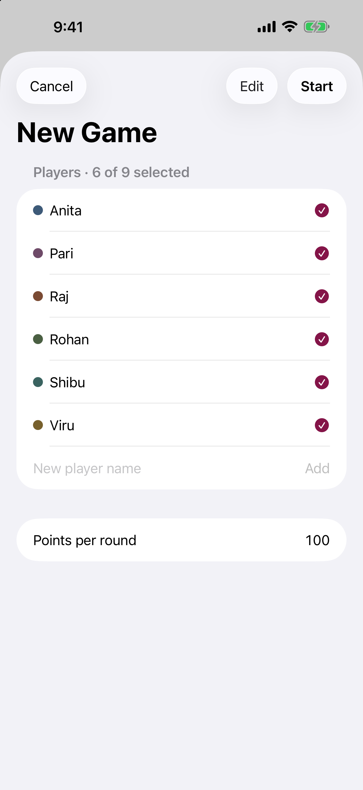
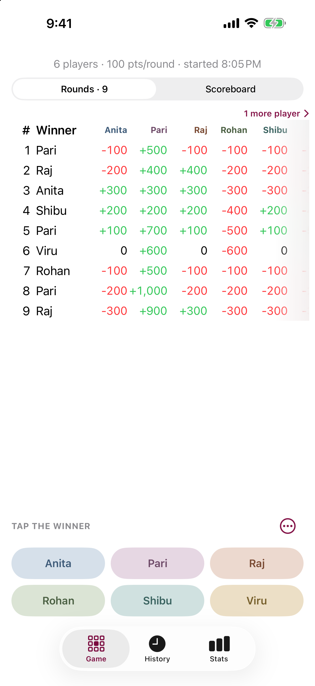
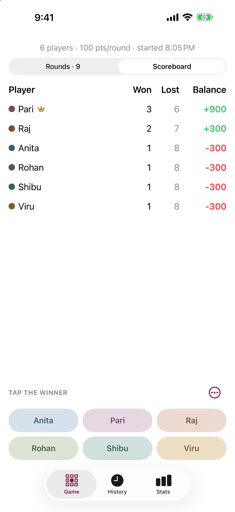
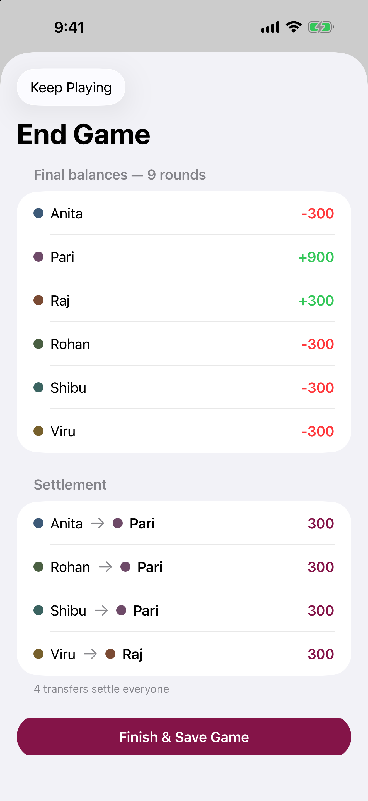
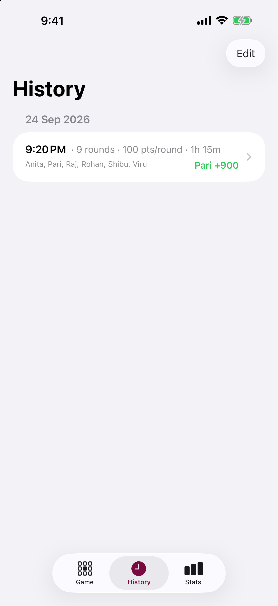
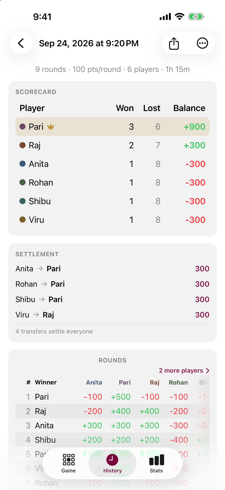
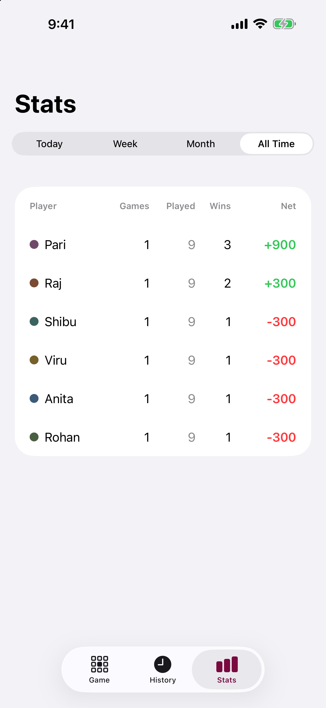

  

<h1 align="center">Sikandar</h1>

<em>A score tracker for group games with two or more players.</em>

Sikandar keeps score for table games where everyone antes and one person wins each round — think teen patti nights with friends. Track every round, see running totals, and when the game ends, Sikandar shows the final settlement so everyone knows exactly where they stand. No more pen and paper, no more arguments.

**Sikandar does not handle any payments or real money. It only keeps score.**

## Screenshots

| New Game | Live Rounds | Scoreboard |
|:---:|:---:|:---:|
|  |  |  |

| Settlement | History | Game Detail | Stats |
|:---:|:---:|:---:|:---:|
|  |  |  |  |

## Features

- **One-tap scoring** — tap the round winner's pill and the table updates. The winner gains `(players − 1) × points`, everyone else loses the round's points.
- **Round feedback** — every tap gives a haptic and a brief "Round 9 · Pari wins" confirmation, and an accidental double-tap never records two rounds.
- **Two views, one switch** — a segmented control flips between the round-by-round table (with cumulative balances per player) and a balance-sorted scoreboard with a crown on the leader. The live game always shows the player count, points per round and start time.
- **2 to 9 players** — winner pills lay out in balanced rows of at most three, so the bar stays tidy at any size. Pills and settlements show full names; only the narrow table columns shorten long names to a unique prefix.
- **Never lose a column** — when more players than fit are in the round table, a "2 more players ›" cue shows how many are off-screen; tap it to jump there.
- **Player colors** — each player gets a muted identity color used consistently across the winner bar, table headers, and history.
- **Deliberate game flow** — starting a game goes through a roster sheet (add, rename, select players; set points per round), and ending one shows the settlement before saving. No accidental taps. A game with no rounds can simply be discarded.
- **Minimal settlement** — game end computes the fewest transfers that square everyone up ("Anita → Pari 300").
- **History** — every finished game is archived by date with its duration, full scoreboard, settlement, and round table. Games can be deleted from History or the game screen.
- **Stats** — per-player games, rounds played, wins, and net across Today / Week / Month / All Time.
- **Undo** — the last round can be undone (with confirmation) at any point; balances are always recomputed from rounds, so totals can never drift.
- **Dark Mode and larger text** — colors adapt to Dark Mode, and tables grow with the system text size.
- **Your games are safe** — Sikandar never deletes your data when something goes wrong. If saved games can't be opened (for example, storage is full), it explains why and lets you retry; before any app update changes how data is stored, it keeps a backup.

## Building

Open `Sikandar.xcodeproj` in Xcode 26 or later and run the `Sikandar` scheme. The app targets iOS and iPadOS 18.2+. No dependencies beyond SwiftUI and Core Data.

The data model (`Player`, `Game`, `GameRound`) lives in `Sikandar/Sikandar.xcdatamodeld`; all UI is in a single SwiftUI file, `Sikandar/sikandar-game-tracker-ui-flexible.swift`.

Run the tests with **Product › Test** (⌘U). `SikandarTests/MigrationTests` opens a saved v1.0.0 store with the current data model and checks that nothing is lost. Run it after any change to the data model.

## Notes

- The player roster is global. A player with recorded games can be removed from the roster; their history and stats stay, and they can be restored from the New Game sheet.
- The New Game sheet pre-selects the previous game's players and points.
- Scores are abstract points with no currency — settle however your table likes.
